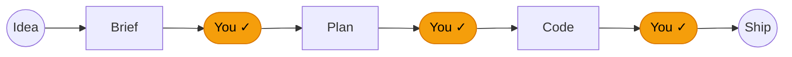

# Claude Goodies

**An opinionated, human-in-the-loop workflow for [Claude Code](https://claude.ai/code).** Turns a rough feature idea into shipped, reviewed, committed code — without you babysitting every step, and without letting Claude ship blind.

Skills, commands, and one adversarial review agent. Every piece explained with a worked example in the [interactive handout](https://user538295.github.io/claude_goodies/handout/) (English · [Magyar](https://user538295.github.io/claude_goodies/handout/index-hu.html)).


> `/feature-refinement` → `/plan-maker` → `/implement` — idea to commit in one session. `/implement all <file>` runs the full plan unattended.

---

## The shape of it



Three human gates, everything else automated (simplified default view; see the full handout for the 4-gate detailed pipeline). The full 9-step pipeline lives in the handout: [agentic-workflow-en.html](https://user538295.github.io/claude_goodies/handout/agentic-workflow-en.html) · [agentic-workflow-hu.html](https://user538295.github.io/claude_goodies/handout/agentic-workflow-hu.html).

---

## What it gives you

Each entry links to its handout page with a worked example.

### Ship a feature, start to finish

- [**`/feature-refinement`**](https://user538295.github.io/claude_goodies/handout/skill-feature-refinement.html) — Turn a rough idea into a brief you can hand off. A senior product thinker walks you through the questions you'd otherwise skip.
- [**`/plan-maker`**](https://user538295.github.io/claude_goodies/handout/skill-plan-maker.html) — Stop staring at a ticket wondering where to start. Breaks the brief into the smallest tasks with tests and dependencies.
- [**`/implement`**](https://user538295.github.io/claude_goodies/handout/cmd-implement.html) — One command for the whole plan, four ways to call it. `/implement next <file>` builds just the next task test-first, reviews itself, and commits — one task, one commit — then stops. `/implement all <file>` loops through every remaining task: it spawns a subagent per task whenever the harness exposes a subagent tool — Claude Code (including `claude -p`), OpenCode, omp, Cursor — and falls back to an inline loop only where no such tool exists. `/implement all inline <file>` forces that inline loop. Bare `/implement <file>` does the task if only one remains, otherwise asks next-or-all (headless defaults to next).
- [**`/quick-plan`**](https://user538295.github.io/claude_goodies/handout/skill-quick-plan.html) — No plan yet and too busy for `/plan-maker`. Defines the goal, success criteria, and 4–12 steps inline — one pass, no file written.
- [**`/commit`**](https://user538295.github.io/claude_goodies/handout/skill-commit.html) — Commit time. Reads the staged diff, writes a Conventional Commits message with a why-first body, and commits. Use `/commit message` to draft the text without touching the repo.
- [**`/wrap-up`**](https://user538295.github.io/claude_goodies/handout/skill-wrap-up.html) — Done for the day, not sure anything slipped. Audits commit hygiene, runs tests and devil's advocate, surfaces what's open — mutates nothing until you say yes.

See `skills/implement/SKILL.md` § NEXT mode, "Step 6: Commit" for the one-task-one-commit rule.

### Fix a bug

- [**`/bugfix`**](https://user538295.github.io/claude_goodies/handout/skill-bugfix.html) — You have a bug and need it gone — not just patched. Drives a four-agent pipeline: failing test first, TDD fix, doc update, full review loop, commit.

### Get a second opinion

- [**`/da-review`**](https://user538295.github.io/claude_goodies/handout/cmd-da-review.html) — A second opinion that actually pushes back. One-pass devil's-advocate review, no auto-fixes.
- [**`/iterative-review`**](https://user538295.github.io/claude_goodies/handout/cmd-iterative-review.html) — A review that doesn't stop at finding problems. Reviewers and fix agents loop until clean.
- [**`/aaa`**](https://user538295.github.io/claude_goodies/handout/skill-aaa.html) — When "looks good to me" isn't enough. Benchmarks an idea against world-class and hands you 3–4 concrete upgrade paths.
- [**`/clean-code-review`**](https://user538295.github.io/claude_goodies/handout/skill-clean-code-review.html) — Code done, want the deep read. Runs 132 checks across 7 groups (clarity, smells, SOLID, architecture, tests, safety, DDD) — on local changes, staged/unstaged/untracked, a git range, a pull/merge-request link, or specific files.
- [**`/options`**](https://user538295.github.io/claude_goodies/handout/skill-options.html) — Stuck between approaches. Produces 2–4 genuinely different paths with honest pros/cons, grounded in your actual project files, and a firm recommendation.

Powered by the [`devils-advocate`](https://user538295.github.io/claude_goodies/handout/agentic-workflow-en.html#da) agent — the thing actually doing the attacking. Auto-invoked by both review commands and inside `/implement`.

### Make Claude remember

- [**`/llm-wiki`**](https://user538295.github.io/claude_goodies/handout/skill-llm-wiki.html) — You've done the research, but Claude keeps forgetting it. Captures notes, sources, decisions; future chats search it first → sharper answers, fewer tokens.
- [**`/llm-wiki-product`**](https://user538295.github.io/claude_goodies/handout/skill-llm-wiki-product.html) — Know exactly where you lose to competitors. Track rivals; get back a value-vs-effort backlog of gaps to close.

### Wrangle docs and skills

- [**`/documentation-standard`**](https://user538295.github.io/claude_goodies/handout/skill-documentation-standard.html) — Docs your team will actually find again. Enforces structure across architecture notes, ADRs, manuals, and dev guides.
- [**`/skill-packager`**](https://user538295.github.io/claude_goodies/handout/skill-skill-packager.html) — Built a Claude Code skill? Make it work in Claude Desktop too. Packages your folder into an upload-ready ZIP.
- [**`/doc-voice`**](https://user538295.github.io/claude_goodies/handout/skill-doc-voice.html) — Docs that read like marketing copy or dry internal prose. Applies a problem-first, proof-led voice to READMEs, handouts, and guides — without touching structure.
- [**`/md-reviewer`**](https://user538295.github.io/claude_goodies/handout/skill-md-reviewer.html) — Terms shift, cross-references rot, contradictions accumulate. Reviews Markdown for consistency, contradictions, and stale links — handles sets of 50+ files.
- [**`/plain-language`**](https://user538295.github.io/claude_goodies/handout/skill-plain-language.html) — Need to explain a technical decision to a non-technical stakeholder. Rewrites it consequence-first, technical detail in parentheses — precise but followable without knowing the codebase.

### Monitor background tasks

- [**`/status-report`**](https://user538295.github.io/claude_goodies/handout/skill-status-report.html) — Kicked off a long task and don't know when it'll finish. Reports status on demand or on a recurring schedule — cancel anytime with `off`.
- [**`/session-log`**](https://user538295.github.io/claude_goodies/handout/skill-session-log.html) — One stable package for Claude Code, Codex, Cursor, OpenCode, and OMP. The host selects its identity explicitly; the package never guesses from paths, processes, or environment variables. Logging and usage stay native to each harness.

Install the universal package once. After `/session-log on`, restart the selected harness when it reports `on — restart required`; Codex instead reports `on — trust review/restart required`, because its new `hooks.json` commands require review before restart.

One script bundle handles the progress plumbing — [`scripts-plan`](https://user538295.github.io/claude_goodies/handout/scripts-plan.html) prints the next-task progress header — `/implement` reads it once in NEXT mode, and on every iteration in ALL mode. The [`session-log`](https://user538295.github.io/claude_goodies/handout/skill-session-log.html) skill archives the prompt and response text exposed by each harness as per-project Markdown; the universal package owns activation and migration for all five harnesses. See the [session-log handout](https://user538295.github.io/claude_goodies/handout/skill-session-log.html) for details.

---

## Install · Update


### Claude Code plugin marketplace

```bash
claude plugin marketplace add user538295/claude_goodies
claude plugin install claude-goodies
```

The marketplace plugin bundles the Claude skill, runtime, and native hooks. Restart Claude Code (or start a new session) for plugin changes to load. To update later:

```bash
claude plugin update claude-goodies@user538295
```

### omp plugin marketplace

```bash
omp plugin marketplace add user538295/claude_goodies
omp plugin install omp-goodies@user538295
```

Inside omp the same steps are `/marketplace add user538295/claude_goodies` and `/marketplace install omp-goodies@user538295`. omp reads its own catalog (`.omp-plugin/marketplace.json`) and installs `omp-goodies`: every skill, both commands as `/omp-goodies:da-review` and `/omp-goodies:iterative-review`, and the `devils-advocate` agent with omp tool names. Run `/reload-plugins` or start a new session to load them. To update later:

```bash
omp plugin marketplace update user538295
omp plugin upgrade omp-goodies@user538295
```

Session logging is opt-in: `/skill:session-log on` seeds the stable package under `~/.omp/agent` and links its extension; restart omp once, after which `/session-log status|on|off|usage` works directly.

Each entrypoint passes its native harness identity explicitly; it never infers a harness from directories or environment variables. `off` never installs an absent adapter.
### Cursor plugin

Cursor reads its own manifests (`.cursor-plugin/plugin.json` and `.cursor-plugin/marketplace.json`) and installs `cursor-goodies`: every skill, both commands, and the `devils-advocate` agent. The plugin ships no hooks; session logging stays opt-in through `/session-log on`. Install it through one of two marketplace routes.

**Cursor Marketplace.** Once Cursor has reviewed and listed the plugin, open **Customize** in the sidebar, search for `cursor-goodies`, select **Install**, and choose a project or user scope. Cursor reviews every update before publishing it.

**Team marketplace** (Teams and Enterprise plans; on Enterprise only admins can add one):

1. Open **Dashboard → Plugins & MCPs**.
2. In **Team Marketplaces**, click **Add Marketplace**, choose **Import from Repo**, and paste `https://github.com/user538295/claude_goodies`.
3. Add `cursor-goodies` with **Add to Marketplace**.
4. Under **Marketplace Settings**, set **Marketplace Access** and optionally **Enable Auto Refresh** (needs the Cursor GitHub App on the repository), then save.
5. Each developer installs `cursor-goodies` from **Customize**, unless an admin set it to Default On or Required.

To update later, Auto Refresh re-indexes the marketplace after each push; otherwise click **Refresh** on the marketplace.

### OpenCode plugin

```bash
opencode plugin add github:user538295/claude_goodies
```

Requires OpenCode V2. OpenCode installs the `opencode-goodies` package (`package.json` plus `.opencode-plugin/index.js`) into its package cache, adds it to `~/.config/opencode/opencode.json`, and loads it without a restart. The plugin registers every skill, the `/da-review` and `/iterative-review` commands, and the `devils-advocate` subagent. To update later:

```bash
opencode plugin update
```

Skills, commands, and agents with the same names under `~/.config/opencode/skills`, `~/.config/opencode/commands`, and `~/.config/opencode/agents` take precedence over the plugin's copies; remove those copies to use the plugin's versions. Session logging stays opt-in through `/session-log on`.


### Universal session-log package

From a checkout of this repository:

```bash
bash install-universal-session-log.sh
```

The wrapper seeds or updates the complete stable package without enabling logging under the five default harness roots: Claude Code `~/.claude`, Codex `~/.codex`, Cursor `~/.cursor`, OpenCode `~/.config/opencode`, and OMP `~/.omp/agent`. It also installs OpenCode's command entrypoint.

To install or update one harness from the checkout, use its explicit identity:

```bash
bash skills/session-log/install.sh --install --harness claude
bash skills/session-log/install.sh --install --harness codex
bash skills/session-log/install.sh --install --harness cursor
bash skills/session-log/install.sh --install --harness opencode
bash skills/session-log/install.sh --install --harness omp
```

A normal command also bootstraps or updates that harness's stable package before dispatching the command:

```bash
bash skills/session-log/install.sh --harness opencode --arguments "on"
```

The supported identities are exactly `claude`, `codex`, `cursor`, `opencode`, and `omp`. The universal `SKILL.md` requires the current host/model to choose one explicitly; identity is never inferred from directories, processes, or environment variables.

Only default roots are supported. OpenCode also reads native data from `~/.local/share/opencode`; relocated config or data roots fail explicitly. Logging remains off until enabled separately in each harness. When logging is already enabled, `status` and `usage` repair a missing or outdated adapter after the package bootstrap.

OpenCode and OMP keep per-process runtime records alongside the shared runtime pointer. The adapters bound their in-memory session history; after a process restart, the on-disk logs remain the source of recorded prompts and responses.


---

## Why this repo has opinions

Unconstrained AI coding produces verbose, coupled code that accumulates fast and is hard to reverse. Constraints aren't slow — they're the thing that makes the output trustworthy enough to ship.

Everything ships with a `CLAUDE.md` that Claude Code loads at the start of every session. It encodes five principles:

1. **Think before coding.** State assumptions, surface tradeoffs, push back when warranted.
2. **Simplicity first.** Minimum code that solves the problem; nothing speculative.
3. **Documentation must stay current.** Every code change updates the docs in the same session. Outdated documentation is treated as a bug.
4. **Surgical changes.** Touch only what the task requires.
5. **Goal-driven execution.** Define success upfront and loop until verified.

Four of these five principles are adapted from [Andrej Karpathy's guidelines](https://github.com/multica-ai/andrej-karpathy-skills/blob/main/skills/karpathy-guidelines/SKILL.md); "Documentation must stay current" is an original addition.

And enforces: tests before code (85%+ coverage), warning-free codebase at all times. `skills/implement/SKILL.md` adds the execution-level rule: one commit per plan task, no batching multiple tasks into a single commit.

By default, the installer 3-way merges your local `~/.claude/CLAUDE.md` changes with the shipped version (when a merge base from a prior run exists) and writes the merged result automatically; on a conflict it writes conflict markers into the file and opens your editor to resolve them. It leaves the file untouched when your copy already matches the shipped one, or when no merge base exists yet. Pass `--overwrite` to replace it outright instead (diff + confirmation in a terminal, silent in non-interactive contexts), or `--keep-claude-md` to leave an existing `CLAUDE.md` alone — a fresh install still installs it either way.

If that's not your speed, this repo isn't for you. If it is — install in 30 seconds.

## Requirements

- Universal session-log: Claude Code, Codex, Cursor, OpenCode, or OMP.
- macOS or Linux — or Windows via WSL.
- bash, Python 3, jq, standard POSIX utilities, and `shasum` or `sha256sum`.
- sqlite3 for OpenCode native usage reports.
- Bun for OMP native usage reports.

No MCP servers are required.

---

Full reference, with worked examples for every skill, command, agent, and script — open the handout:
**[English](https://user538295.github.io/claude_goodies/handout/) · [Magyar](https://user538295.github.io/claude_goodies/handout/index-hu.html)**.
